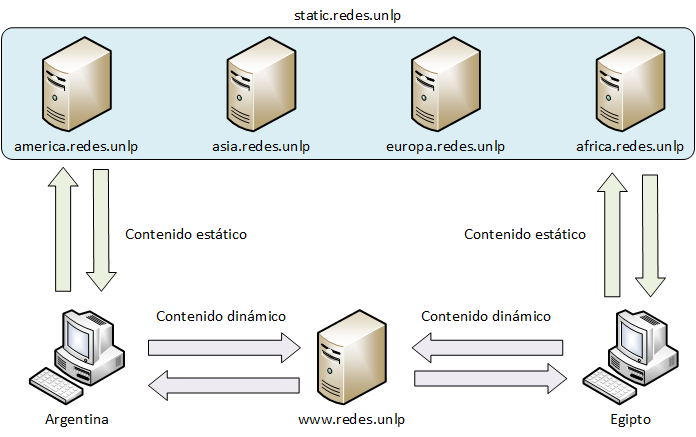
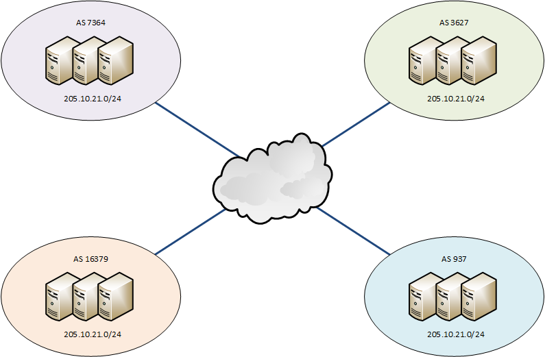
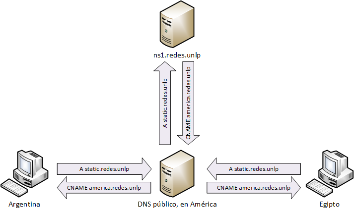

!SLIDE center
# Content Delivery Networks (CDN) #
## Redes y Servicios Avanzados en Internet ##

!SLIDE smbullets transition=uncover
# Content Delivery Networks (CDN) #
 
Leandro Di Tommaso
  
  
  

 
 
Content Delivery Networks (CDN) por Leandro Di Tommaso se encuentra bajo
una <a rel="license"
href="http://creativecommons.org/licenses/by-nc-sa/3.0/deed.es">Licencia
Creative Commons Atribución-NoComercial-CompartirIgual 3.0 Unported</a>.

!SLIDE smbullets incremental
# Temas
* ¿Qué es una CDN?
* Funcionamiento de una CDN.
* Aspectos técnicos de una CDN.
  * Contenido estático vs. contenido dinámico.
  * Identificación de los servidores más cercanos.
  * Reenvío a la CDN.
  * Carga del contenido en la CDN.
  * Intercepción de los requerimientos de usuario.
* Laboratorio.
* Caso de análisis: La Bioguía.
* Referencias.

!SLIDE smbullets transition=uncover
# ¿Qué es una CDN? #

* Sistema de servidores ubicados en diferentes lugares del mundo.
* Sirve contenido web estático.
* Selección del servidor por cercanía geográfica.
* Puede devolver versiones cacheadas del sitio web.

!SLIDE smbullets transition=uncover
# Beneficios de usar una CDN #

* Acceso veloz al contenido.
* Escalabilidad y disponibilidad.
* Reducción del uso de los enlaces de manera global.
* Fidelización de los usuarios.
* Disminuición del uso de los recursos en el sistema de origen.

!SLIDE smbullets transition=uncover
# Funcionamiento de una CDN #

!SLIDE smbullets transition=uncover
# Servidores más cercanos #

Se debe dirigir al cliente al servidor más conveniente.

Existen dos maneras para identificar los servidores más cercanos:

* Utilizando Anycast.
* Utilizando DNS.

!SLIDE smbullets transition=uncover
# Utilizando Anycast #

!SLIDE smbullets transition=uncover
# Utilizando DNS #

!SLIDE smbullets transition=uncover
# DNS por origen #

* Implementado con vistas.
* Con parche GeoIP para BIND.
* Utilizando eDNS client-subnet.

!SLIDE smbullets transition=uncover
# Problemas con DNS por origen #

!SLIDE smbullets transition=uncover
# Ventajas de anycast #

* Rápida adaptación frente a fallos.
* Mejor selección del servidor más cercano.

!SLIDE smbullets transition=uncover
# Desventajas de anycast #

* Implementación y administración complejas.
* Requiere conocimientos de BGP.
* Mayor costo, menor flexibilidad.
* Difícil agregar nuevas ubicaciones.
* Dependencia de terceros.

!SLIDE smbullets transition=uncover
# Ventajas de DNS #

* Funcionamiento simple y fácil de entender.
* Puede implementarse sin intervención de terceros.
* Bajo costo.

!SLIDE smbullets transition=uncover
# Desventajas de DNS #

* Problemas con servidores "proxy".
* Caché de DNS.
* Respuesta ante fallos.

!SLIDE smbullets transition=uncover
# Reenvío a la CDN #

* Peticiones llegan al servidor de origen.
* Determinados recursos deben buscarse en la CDN.

* Posibles soluciones:
  * Redirección basada en la extensión. 
  * Dominio diferente para la CDN.

!SLIDE smbullets transition=uncover
# Carga del contenido en la CDN #

* Utilizando sincronización periódica.
* Disparando orden de actualización.
* Por medio de servidores proxy caché.
