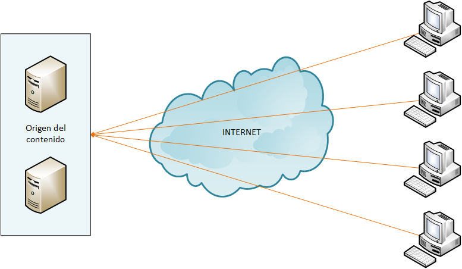
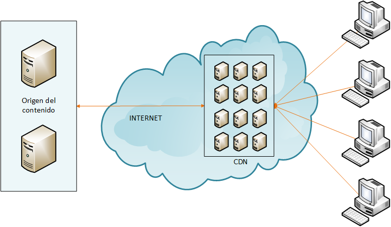
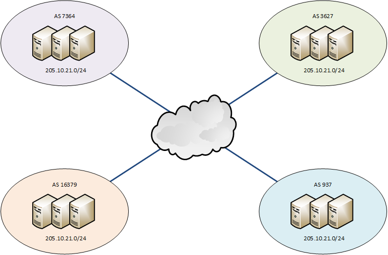
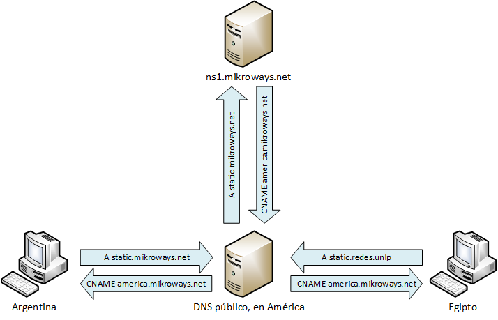

!SLIDE center
# Content Delivery Networks #
## Introducción ##

!SLIDE transition=uncover
# Content Delivery Networks #
 
Leandro Di Tommaso

!SLIDE smbullets transition=uncover
# Temas
* ¿Qué es una CDN?
* Funcionamiento de una CDN.
* Aspectos técnicos de una CDN.
  * Contenido estático vs. contenido dinámico.
  * Identificación de los servidores más cercanos.
  * Reenvío a la CDN.
  * Carga del contenido en la CDN.
  * Intercepción de los requerimientos de usuario.
* Referencias.

!SLIDE smbullets transition=uncover
# ¿Qué es una CDN? #

* Sistema de servidores ubicados en diferentes lugares del mundo.
* Sirve contenido web estático.
* Selección del servidor por cercanía geográfica.
* Puede devolver versiones cacheadas del sitio web.

!SLIDE smbullets transition=uncover
# Beneficios de usar una CDN #

* Acceso veloz al contenido.
* Escalabilidad y disponibilidad.
* Reducción del uso de los enlaces de manera global.
* Fidelización de los usuarios.
* Disminución del uso de los recursos en el sistema de origen.

!SLIDE smbullets transition=uncover
# Funcionamiento sin CDN #

!SLIDE smbullets transition=uncover
# Funcionamiento con CDN #

!SLIDE smbullets transition=uncover
# Servidores más cercanos #

Se debe dirigir al cliente al servidor más conveniente. Existen dos maneras para identificar los servidores más cercanos:

* Utilizando Anycast.
* Utilizando DNS.

!SLIDE smbullets transition=uncover
# Utilizando Anycast #

!SLIDE smbullets transition=uncover
# Utilizando DNS #

!SLIDE smbullets transition=uncover
# DNS por origen #

* Implementado con vistas.
* Con parche GeoIP para BIND.
* Utilizando eDNS client-subnet.

!SLIDE smbullets transition=uncover
# Problemas con DNS por origen #

!SLIDE smbullets transition=uncover
# Ventajas de anycast #

* Rápida adaptación frente a fallos.
* Mejor selección del servidor más cercano.

!SLIDE smbullets transition=uncover
# Desventajas de anycast #

* Implementación y administración complejas.
* Requiere conocimientos de BGP.
* Mayor costo, menor flexibilidad.
* Difícil agregar nuevas ubicaciones.
* Dependencia de terceros.

!SLIDE smbullets transition=uncover
# Ventajas de DNS #

* Funcionamiento simple y fácil de entender.
* Puede implementarse sin intervención de terceros.
* Bajo costo.

!SLIDE smbullets transition=uncover
# Desventajas de DNS #

* Problemas con servidores "proxy".
* Caché de DNS.
* Respuesta ante fallos.

!SLIDE smbullets transition=uncover
# Reenvío a la CDN #

* Peticiones llegan al servidor de origen.
* Determinados recursos deben buscarse en la CDN.
* Posibles soluciones:
  * Redirección basada en la extensión. 
  * Dominio diferente para la CDN.

!SLIDE smbullets transition=uncover
# Carga del contenido en la CDN #

* Utilizando sincronización periódica.
* Disparando orden de actualización.
* Por medio de servidores proxy caché.

!SLIDE smbullets transition=uncover
# Referencias #

* [Esta presentación]()
* [Client subnet in DNS request](http://tools.ietf.org/id/draft-vandergaast-edns-client-subnet-02.html)
* [How to test your CDN before go live](http://www.cdnplanet.com/blog/how-test-your-cdn-before-go-live/)
* [Rolling your own CDN](http://www.scalescale.com/rolling-your-own-cdn-build-a-3-continent-cdn-for-25-in-1-hour/)
* [Which CDNs support edns-client-subnet](http://www.cdnplanet.com/blog/which-cdns-support-edns-client-subnet/)

!SLIDE center
# ¿Preguntas? #
