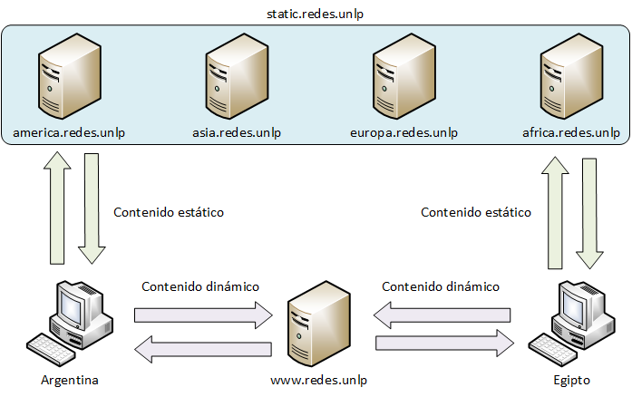
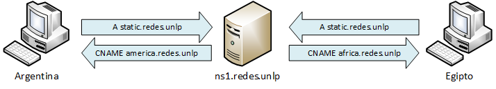

!SLIDE center
# Content Delivery Networks #
## Laboratorio: implementación local ##

!SLIDE smbullets transition=uncover
# Temas
* Diseño.
* Implementación.
* Pruebas de funcionamiento.
  * Verificación de caché.
  * Acceso y monitoreo de logs.
* Posibles extensiones.

!SLIDE smbullets transition=uncover
# Diseño

!SLIDE smbullets transition=uncover
# Diseño

!SLIDE smbullets transition=uncover
# Implementación

* Total de 8 máquinas virtuales con Vagrant y Chef Solo.
* Un servidor web con la página www.redes.unlp.
* Un servidor DNS para el dominio redes.unlp.
* Cuatro servidores para formar la CDN.
* Dos clientes para probar el acceso al sitio desde diferentes ubicaciones.

!SLIDE smbullets transition=uncover
# Implementación

* Servidor web:
  * Sitio web dinámico con Wordpress.
  * Nginx, PHP-FPM y MySQL.
* Servidor DNS:
  * Estrategia utilizando vistas.
  * BIND.

!SLIDE smbullets transition=uncover
# Implementación de la CDN

* Nginx como proxy reverso y caché.
* Dominio específico para la CDN.
* Recursos no existentes se traen desde el origen y se almacenan en caché.

!SLIDE smbullets transition=uncover
# Asignaciones IP

* Servidor web: 190.205.40.3
* Servidor DNS: 190.205.40.8
* Argentina: 190.205.40.10
* Egipto: 190.205.40.11

!SLIDE smbullets transition=uncover
# Asignaciones IP

* África: 222.12.25.22
* América: 189.32.120.14
* Asia: 154.23.129.10
* Europa: 105.4.12.3

!SLIDE smbullets transition=uncover
# Pruebas de funcionamiento

* Verificar los logs y la caché de cada servidor de la CDN y del servidor web.
* Consultar la IP de www.redes.unlp y de static.redes.unlp con el cliente Argentina.
* Acceder con el cliente Argentina a www.redes.unlp y visualizar el sitio web.
* Verificar la caché del servidor de la CDN América.
* Visualizar los logs del servidor web y del servidor de la CDN.

!SLIDE smbullets transition=uncover
# Pruebas de funcionamiento

* Verificar los logs del servidor América y del servidor web.
* Acceder nuevamente con el cliente Argentina a www.redes.unlp y visualizar el sitio.
* Chequear los logs del servidor web y del servidor de la CDN.

!SLIDE smbullets transition=uncover
# Pruebas de funcionamiento

* Verificar los logs y la caché de cada servidor de la CDN y del servidor web.
* Consultar la IP de www.redes.unlp y de static.redes.unlp con el cliente Egipto.
* Acceder con el cliente Egipto a www.redes.unlp y visualizar el sitio web.
* Verificar la caché del servidor de la CDN África.
* Visualizar los logs del servidor web y del servidor de la CDN.

!SLIDE smbullets transition=uncover
# Pruebas de funcionamiento

* Verificar los logs del servidor África y del servidor web.
* Acceder nuevamente con el cliente Egipto a www.redes.unlp y visualizar el sitio.
* Chequear los logs del servidor web y del servidor de la CDN.

!SLIDE smbullets transition=uncover
# Aclaración importante

Las IP que se muestran en los logs de la presentación fueron modificadas a mano para una visión más real de los accesos. El motivo por el que se hizo esto es que VirtualBox implementa toda la red interna usando NAT y entonces se pierden las direcciones IP originales.

Por lo anterior, los logs que se vean en el laboratorio no coincidirán con los mostrados en esta presentación.

!SLIDE smbullets transition=uncover
# Verificación de caché

<pre><code>root@cdn-africa:~# ls -lh /var/cache/nginx/
total 0

root@cdn-america:~# ls -lh /var/cache/nginx/
total 0

root@cdn-asia:~# ls -lh /var/cache/nginx/
total 0

root@cdn-europa:~# ls -lh /var/cache/nginx/
total 0
</code></pre>

En este punto se realiza el acceso al sitio www.redes.unlp desde el cliente
Argentina.

!SLIDE smbullets transition=uncover
# Logs del servidor web

<pre><code><code>root@cdn-www:~# tail -f /var/log/nginx/wordpress-access.log
190.205.40.10 - - [31/Aug/2014:20:39:55 +0000] "GET / HTTP/1.1" 200 2759 "-"
"Mozilla/5.0 (X11; Ubuntu; Linux x86_64; rv:31.0) Gecko/20100101 Firefox/31.0"

189.32.120.14 - - [31/Aug/2014:20:39:55 +0000] "GET
/wp-content/themes/twentyfourteen/genericons/genericons.css?ver=3.0.2 HTTP/1.0"
200 22680 "http://www.redes.unlp/" "Mozilla/5.0 (X11; Ubuntu; Linux x86_64;
rv:31.0) Gecko/20100101 Firefox/31.0"

189.32.120.14 - - [31/Aug/2014:20:39:55 +0000] "GET
/wp-content/themes/twentyfourteen/style.css?ver=3.9.2 HTTP/1.0" 200 75703
"http://www.redes.unlp/" "Mozilla/5.0 (X11; Ubuntu; Linux x86_64; rv:31.0)
Gecko/20100101 Firefox/31.0"

189.32.120.14 - - [31/Aug/2014:20:39:55 +0000] "GET
/wp-includes/js/jquery/jquery-migrate.min.js?ver=1.2.1 HTTP/1.0" 200 7200
"http://www.redes.unlp/" "Mozilla/5.0 (X11; Ubuntu; Linux x86_64; rv:31.0)
Gecko/20100101 Firefox/31.0"

189.32.120.14 - - [31/Aug/2014:20:39:55 +0000] "GET
/wp-includes/js/jquery/jquery.js?ver=1.11.0 HTTP/1.0" 200 96402
"http://www.redes.unlp/" "Mozilla/5.0 (X11; Ubuntu; Linux x86_64; rv:31.0)
Gecko/20100101 Firefox/31.0"

189.32.120.14 - - [31/Aug/2014:20:39:55 +0000] "GET
/wp-content/themes/twentyfourteen/js/functions.js?ver=20140319 HTTP/1.0" 200
3393 "http://www.redes.unlp/" "Mozilla/5.0 (X11; Ubuntu; Linux x86_64; rv:31.0)
Gecko/20100101 Firefox/31.0"

189.32.120.14 - - [31/Aug/2014:20:39:55 +0000] "GET
/wp-content/uploads/2014/08/CDN_LL_acceso_clientes-300x188.png HTTP/1.0" 200
22069 "http://www.redes.unlp/" "Mozilla/5.0 (X11; Ubuntu; Linux x86_64; rv:31.0)
Gecko/20100101 Firefox/31.0"
</code></code></pre>

!SLIDE smbullets transition=uncover
# Logs de América

<pre><code><code>root@cdn-america:~# tail -f /var/log/nginx/access.log
190.205.40.10 - - [31/Aug/2014:20:39:55 +0000] "GET
/wp-content/themes/twentyfourteen/genericons/genericons.css?ver=3.0.2 HTTP/1.1"
304 0 "http://www.redes.unlp/" "Mozilla/5.0 (X11; Ubuntu; Linux x86_64; rv:31.0)
Gecko/20100101 Firefox/31.0"

190.205.40.10 - - [31/Aug/2014:20:39:55 +0000] "GET
/wp-content/themes/twentyfourteen/style.css?ver=3.9.2 HTTP/1.1" 304 0
"http://www.redes.unlp/" "Mozilla/5.0 (X11; Ubuntu; Linux x86_64; rv:31.0)
Gecko/20100101 Firefox/31.0"

190.205.40.10 - - [31/Aug/2014:20:39:55 +0000] "GET
/wp-includes/js/jquery/jquery-migrate.min.js?ver=1.2.1 HTTP/1.1" 304 0
"http://www.redes.unlp/" "Mozilla/5.0 (X11; Ubuntu; Linux x86_64; rv:31.0)
Gecko/20100101 Firefox/31.0"

190.205.40.10 - - [31/Aug/2014:20:39:55 +0000] "GET
/wp-includes/js/jquery/jquery.js?ver=1.11.0 HTTP/1.1" 304 0
"http://www.redes.unlp/" "Mozilla/5.0 (X11; Ubuntu; Linux x86_64; rv:31.0)
Gecko/20100101 Firefox/31.0"

190.205.40.10 - - [31/Aug/2014:20:39:55 +0000] "GET
/wp-content/themes/twentyfourteen/js/functions.js?ver=20140319 HTTP/1.1" 304 0
"http://www.redes.unlp/" "Mozilla/5.0 (X11; Ubuntu; Linux x86_64; rv:31.0)
Gecko/20100101 Firefox/31.0"

190.205.40.10 - - [31/Aug/2014:20:39:55 +0000] "GET
/wp-content/uploads/2014/08/CDN_LL_acceso_clientes-300x188.png HTTP/1.0" 200
22069 "http://www.redes.unlp/" "Mozilla/5.0 (X11; Ubuntu; Linux x86_64; rv:31.0)
Gecko/20100101 Firefox/31.0"
</code></code></pre>

!SLIDE smbullets transition=uncover
# Caché de América

<pre><code><code>root@cdn-america:~# ls -lh /var/cache/nginx/
total 232K
-rw------- 1 www-data www-data  23K Aug 31 20:39 4cc6a94f110409edd133cc03f44c3c41
-rw------- 1 www-data www-data 3.7K Aug 31 20:39 4fb6e062da05d1bb0f629528ed3c009e
-rw------- 1 www-data www-data  22K Aug 31 20:39 5340bd0fef34cb5228d746c5d5e96732
-rw------- 1 www-data www-data 7.4K Aug 31 20:39 a1906fec651d253e058df6e90534936e
-rw------- 1 www-data www-data  75K Aug 31 20:39 d339df79a142ffe55db8e46797d27c29
-rw------- 1 www-data www-data  95K Aug 31 20:39 e06d67fc53f9f40412d1181595d361e7

root@cdn-america:~# head -19 /var/cache/nginx/4fb6e062da05d1bb0f629528ed3c009e |
tail -18
KEY:
http://www.redes.unlp/wp-content/themes/twentyfourteen/js/functions.js?ver=20140319
HTTP/1.1 200 OK
Server: nginx
Date: Sun, 31 Aug 2014 20:39:55 GMT
Content-Type: application/x-javascript
Content-Length: 3393
Last-Modified: Thu, 28 Aug 2014 05:36:17 GMT
Connection: close
Vary: Accept-Encoding
Accept-Ranges: bytes

/**
 * Theme functions file
 *
 * Contains handlers for navigation, accessibility, header sizing
 * footer widgets and Featured Content slider
 *
 */

</code></code></pre>

!SLIDE smbullets transition=uncover
# Logs del servidor web

Se vuelven a verificar los logs luego de un nuevo acceso desde el cliente Argentina al sitio www.redes.unlp

<pre><code><code>root@cdn-www:~# tail -f /var/log/nginx/wordpress-access.log
190.205.40.10 - - [31/Aug/2014:21:37:48 +0000] "GET / HTTP/1.1" 200 2760 "-"
"Mozilla/5.0 (X11; Ubuntu; Linux x86_64; rv:31.0) Gecko/20100101 Firefox/31.0"
</code></code></pre>

!SLIDE smbullets transition=uncover
# Logs de América

<pre><code><code>root@cdn-america:~# tail -f /var/log/nginx/access.log
190.205.40.10 - - [31/Aug/2014:21:37:47 +0000] "GET
/wp-content/themes/twentyfourteen/genericons/genericons.css?ver=3.0.2 HTTP/1.1"
304 0 "http://www.redes.unlp/" "Mozilla/5.0 (X11; Ubuntu; Linux x86_64; rv:31.0)
Gecko/20100101 Firefox/31.0"

190.205.40.10 - - [31/Aug/2014:21:37:47 +0000] "GET
/wp-content/themes/twentyfourteen/style.css?ver=3.9.2 HTTP/1.1" 304 0
"http://www.redes.unlp/" "Mozilla/5.0 (X11; Ubuntu; Linux x86_64; rv:31.0)
Gecko/20100101 Firefox/31.0"

190.205.40.10 - - [31/Aug/2014:21:37:47 +0000] "GET
/wp-includes/js/jquery/jquery-migrate.min.js?ver=1.2.1 HTTP/1.1" 304 0
"http://www.redes.unlp/" "Mozilla/5.0 (X11; Ubuntu; Linux x86_64; rv:31.0)
Gecko/20100101 Firefox/31.0"

190.205.40.10 - - [31/Aug/2014:21:37:47 +0000] "GET
/wp-includes/js/jquery/jquery.js?ver=1.11.0 HTTP/1.1" 304 0
"http://www.redes.unlp/" "Mozilla/5.0 (X11; Ubuntu; Linux x86_64; rv:31.0)
Gecko/20100101 Firefox/31.0"

190.205.40.10 - - [31/Aug/2014:21:37:47 +0000] "GET
/wp-content/themes/twentyfourteen/js/functions.js?ver=20140319 HTTP/1.1" 304 0
"http://www.redes.unlp/" "Mozilla/5.0 (X11; Ubuntu; Linux x86_64; rv:31.0)
Gecko/20100101 Firefox/31.0"

190.205.40.10 - - [31/Aug/2014:21:37:48 +0000] "GET
/wp-content/uploads/2014/08/CDN_LL_acceso_clientes-300x188.png HTTP/1.1" 304 0
"http://www.redes.unlp/" "Mozilla/5.0 (X11; Ubuntu; Linux x86_64; rv:31.0)
Gecko/20100101 Firefox/31.0"
</code></code></pre>

!SLIDE smbullets transition=uncover
# Posibles extensiones
* Reemplazar las vistas por eDNS end-client-subnet.
* Implementar Varnish para caché en memoria de recursos y páginas.
* Estructura jerárquica para minimizar los accesos al servidor de origen desde
los servidores de la CDN.
* ¿Otras ideas?

!SLIDE center
# ¿Preguntas? #
