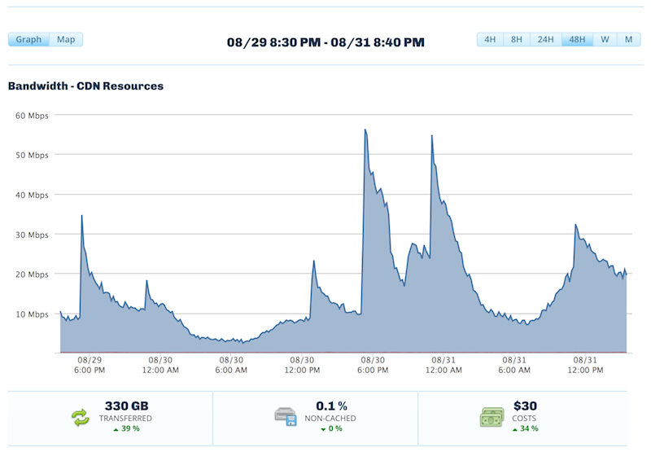
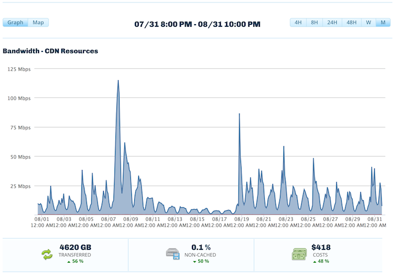
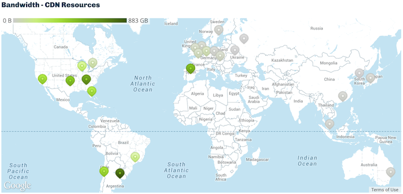

!SLIDE center
# Content Delivery Networks (CDN) #
## Caso de análisis: La Bioguía ##

!SLIDE smbullets transition=uncover
# Temas
* ¿Qué es La Bioguía?
* Problemática inicial.
* Optimización del servicio.
* Implementación de la CDN.
* Problemática actual.
* Conclusiones.

!SLIDE smbullets transition=uncover
# ¿Qué es La Bioguía? #
"[La Bioguía](http://www.labioguia.com) es el portal y la comunidad digital más grande de habla hispana de
la nueva cultura sustentable."

!SLIDE smbullets transition=uncover
# Problemática inicial

* El máximo de visitantes simultáneos del sitio no superaba los 60.
* Se necesitaba soportar 4.000 visitantes simultáneos.
* Página de Facebook con más de 1.000.000 de me gusta.
* Picos importantes en períodos breves de tiempo (al publicar un enlace en
  Facebook).

!SLIDE smbullets transition=uncover
# Optimización del servicio

* Contratar un servidor más grande (16GB RAM, 6 núcleos).
* Adquirir ancho de banda adicional (35Mbps de subida).
* Realizar ajustes a la página para disminuir su tamaño.
* Instalar Nginx, PHP-FPM, Varnish y optimizar varios parámetros de la BBDD y
  del sistema operativo.

!SLIDE smbullets transition=uncover
# No para de crecer...

Con los cambios realizados, se logran alcanzar los 4.000 visitantes simultáneos, 
pero el techo cambió.

* Se satura el ancho de banda al tiempo que la memoria y la capacidad de cómputo
  del servidor no se aprovechan.
* La mayor cantidad de tráfico son contenidos estáticos (imágenes, hojas de
  estilo, javascripts).
* Hora de que la CDN demuestre lo que promete.

!SLIDE smbullets transition=uncover
# Implementación de la CDN

* Elección del proveedor: [CDN 77](http://www.cdn77.com)
* Dominio diferente para la CDN.
* Plugin para Wordpress: W3 Total Cache.

!SLIDE smbullets transition=uncover
# Consumo 48 horas

!SLIDE smbullets transition=uncover
# Consumo 1 mes

!SLIDE smbullets transition=uncover
# Mapa de accesos

!SLIDE smbullets transition=uncover
# Resultados

* El día de la implementación se alcanzaron 15.000 simultáneas.
* Pico de consumo en la CDN de 411 Mbps.
* El ancho de banda al servidor bajó a 6 Mbps.
* Recursos (memoria y CPU) se convirtieron en el nuevo límite.
* Necesario disminuir los enlaces en hora pico para soportar la carga (¡mientras
  se consigue financiamiento!).

!SLIDE smbullets transition=uncover
# ¿Y ahora?

* La CDN permitió crecer exponencialmente, el límite quedó nuevamente del lado
  del servidor de origen.
* Se debe aumentar la capacidad del servidor de origen.
  * Un servidor más potente.
  * Varios servidores en cluster.
* Actualmente en proceso de migración a Amazon.

!SLIDE center
# ¿Preguntas? #

